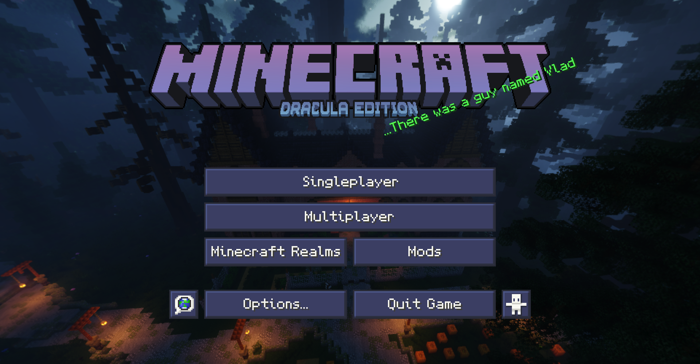

# Dracula for [Minecraft](https://minecraft.net)

> A dark theme for [Minecraft](https://minecraft.net).

## About

Looking for a dark GUI with vanilla textures, but want something more colorful and stylized than existing ones? This is the pack for you!

**Dracula Theme - Hybrid** is a full makeover of the vanilla GUI using colores from the [Dracula Color Palette](https://draculatheme.com/contribute) with the goal of not only being easy on the eyes, but more interesting to use, too! Featuring custom UI sounds, a unique title screen and even mod support! (wip)

## Install

#### Find your resourcepacks folder

To install this theme you need to first find your resourcepack folder. The quickest and easiest way to do this is from in-game.

1. Open up your desired version of Minecraft.
2. Go into "Options" and then "Resource Packs"
3. Click "Open Pack Folder"

#### Download the pack

After opening your resourcepacks folder, simply put your desired pack in .zip format there. You can download the pack for nearly all versions of minecraft at the links below:

|  |  |  |
| --- | --- | --- |
| [Modrinth](https://modrinth.com/resourcepack/dracula-theme) | [Curseforge](https://www.curseforge.com/minecraft/texture-packs/dracula-theme) | [Github](https://github.com/dracula/minecraft/releases) |

*Note: CurseForge will typically get updates slower than other sites.*

##### If you have any troubles installing, check out the Minecraft Wiki page on [how to install resourcepacks](https://minecraft.fandom.com/wiki/Tutorials/Loading_a_resource_pack).

## Team

This theme is maintained by the following person(s) and a bunch of [awesome contributors](https://github.com/dracula/minecraft/graphs/contributors).
 
|  | 
| --------------------------------------------------------------------------------- | 
| [Xetheon](https://github.com/xetheon)                                             |

## Community

- [Twitter](https://twitter.com/draculatheme) - Best for getting updates about themes and new stuff.
- [GitHub](https://github.com/dracula/dracula-theme/discussions) - Best for asking questions and discussing issues.
- [Discord](https://draculatheme.com/discord-invite) - Best for hanging out with the community.

## License

[MIT License](./LICENSE)
