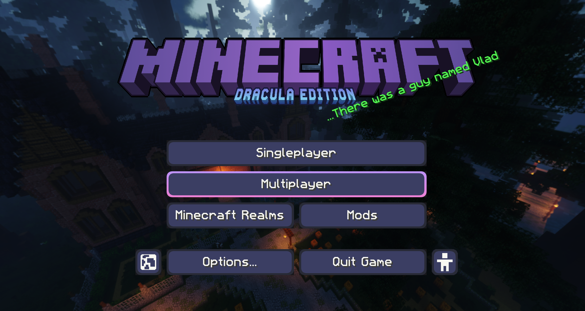

# Dracula for [Minecraft](https://minecraft.net)

> A dark theme for [Minecraft](https://minecraft.net).

## Install

#### Install using Git

If you are a git user, you can install the theme and keep up to date by cloning the repo:

    git clone https://github.com/dracula/minecraft

#### Download manually

Go to [Releases](https://github.com/dracula/minecraft/releases) and get it there or download it from [CurseForge](https://www.curseforge.com/minecraft/texture-packs/dracula-ui)

#### Installing pack

1. Open up Minecraft
2. Go to Options > Resource Packs > Open Pack Folder
3. Place the .zip of your desired release into the resourcepacks folder
4. Enable within Minecraft and enjoy! (Note: If you use the colored shulkers addon, make sure it's above the base Dracula pack.)

If you have any troubles installing, check out the Minecraft Wiki page on [how to install resourcepacks](https://minecraft.fandom.com/wiki/Tutorials/Loading_a_resource_pack).

## Team

This theme is maintained by the following person(s) and a bunch of [awesome contributors](https://github.com/dracula/minecraft/graphs/contributors).
 
|  | 
| --------------------------------------------------------------------------------- | 
| [Xetheon](https://github.com/xetheon)                                             |

## Community

- [Twitter](https://twitter.com/draculatheme) - Best for getting updates about themes and new stuff.
- [GitHub](https://github.com/dracula/dracula-theme/discussions) - Best for asking questions and discussing issues.
- [Discord](https://draculatheme.com/discord-invite) - Best for hanging out with the community.

## License

[MIT License](./LICENSE)
